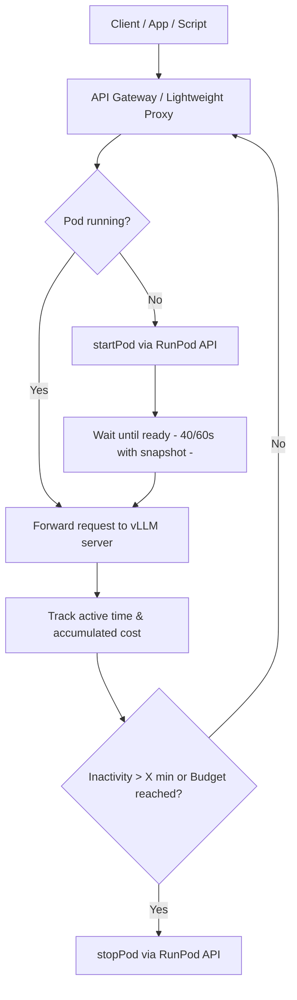

# 🚀 On‑Demand Deployment of GPT‑OSS‑20B on RunPod with RTX A5000

This repository provides a step‑by‑step guide to deploy GPT‑OSS‑20B on RunPod using an RTX A5000 (24 GB) GPU in on‑demand mode. The setup includes automatic startup when a request is received, automatic shutdown after inactivity, monthly budget control, and a pre‑loaded snapshot for faster initialization (~40–60 seconds).

## 💰 Cost Estimation

Using **RunPod Community Cloud** with an **RTX A5000 (24 GB)** at ~$0.16/hour:

| Usage Scenario          | GPU Hours per Day | Hourly Price | Monthly GPU Cost | Other Costs* | **Total Monthly** |
|-------------------------|-------------------|--------------|------------------|--------------|-------------------|
| **On‑Demand** (~10h/day) | 10h               | $0.16        | ~$48             | $2–$5        | **$50–$53**       |
| **24/7**                | 24h               | $0.16        | ~$115            | $2–$5        | **$117–$120**     |

\* Other costs include storage (40–60 GB) and a lightweight API proxy (optional).  

**Key savings:**  
Compared to keeping the GPU running all the time, the on‑demand setup can reduce costs by **over 55%** while maintaining unlimited token usage.

## 🏗 Architecture

The system minimizes GPU costs by starting the **RunPod Pod** only when a request is received and shutting it down after a configurable inactivity period. It also tracks monthly usage to prevent exceeding a defined budget.


## 📋 Prerequisites

Before setting up this architecture, make sure you have:

- **RunPod account** – [Sign up here](https://www.runpod.io/).
- **RunPod API Key** – Needed to start/stop Pods programmatically.
- **Hugging Face account** – [Sign up here](https://huggingface.co/) to download the GPT‑OSS‑20B model.
- **Basic knowledge of Python** – For running the control scripts.
- **A lightweight server or service for the API Gateway**:
  - Cloudflare Workers (free tier)
  - A small VPS like Hetzner CX11 (€4/month)
- **Git** and **Python 3.9+** installed locally if you want to test the proxy.
## 🛠 Step 1 — Create the Pod on RunPod


1. Go to the **[RunPod Pricing page](https://www.runpod.io/pricing)** and select **Community Cloud**.
2. Choose the following configuration:
   - **GPU**: RTX A5000 (24 GB) – ~$0.16/hour.
   - **Template**: *Start from Image* → Ubuntu 22.04.
   - **Disk**: 40–60 GB (recommended 60 GB if you want to store multiple models).
   - **Ports**: Open **8000** for the vLLM API.
3. Launch the Pod.
4. Once the Pod is running, note down:
   - **Pod ID** (needed for the API control script).
   - **Public IP / Hostname**.

## 🛠 Step 2 — Install vLLM and GPT‑OSS‑20B

Once your Pod is running, connect to it via the RunPod web terminal or SSH.

1. **Update the system and install dependencies:**
```bash
sudo apt update && sudo apt install -y python3-pip git
```

2. **Clone and install vLLM:**
```bash
git clone https://github.com/vllm-project/vllm.git
````
```bash
cd vllm
````
```bash
pip install -e .
```
3. **Install Hugging Face Hub client:**
```bash
pip install huggingface_hub
```
4. **Download the GPT‑OSS‑20B model from Hugging Face:**
```bash
python3 -m huggingface_hub download openai/gpt-oss-20b \
  --local-dir /workspace/model
```
5. **Start vLLM in OpenAI-compatible API mode:**
```bash
python3 -m vllm.entrypoints.openai.api_server \
  --model /workspace/model \
  --port 8000 \
  --max-model-len 8192
```
6. **Test the API endpoint by visiting:**
```bash
http://<POD_IP>:8000/v1/models
```

If everything is working, you should see a JSON response listing your model.

## 🛠 Step 3 — Create a Snapshot for Fast Startup

A snapshot (or template) allows you to start the Pod with the model and dependencies already loaded, reducing startup time to ~20–30 seconds plus VRAM loading (~15–25s in 4‑bit).

1. In the **RunPod dashboard**, open your running Pod.
2. Click **"Create Template from Pod"**.
3. Give the template a clear name (e.g., `gpt-oss-20b-vllm`).
4. The template will save:
   - Installed dependencies (vLLM, Hugging Face).
   - Downloaded GPT‑OSS‑20B model.
   - Your configuration.

**To launch from the snapshot:**
1. Go to **Pods → Create Pod**.
2. Select **My Templates** and choose your saved template.
3. Start the Pod — it will already contain your environment and model.

**Tip:**  
Using a snapshot reduces startup time from 2–5 minutes to ~40–60 seconds.

## 🛠 Step 4 — Configure the API Gateway / Proxy

The API Gateway (or lightweight proxy) is responsible for:
- Receiving incoming requests.
- Starting the Pod if it’s stopped.
- Forwarding requests to the vLLM API once the Pod is running.
- Tracking usage and shutting down the Pod after inactivity or when the monthly budget is reached.

You can deploy the proxy on:
- **Cloudflare Workers** (free tier, no server needed).
- A small VPS like **Hetzner CX11** (~€4/month).
- Any low-cost cloud instance.

### Implementation

We provide an example **FastAPI proxy script** in [`proxy/main.py`](proxy/main.py) that:
- Connects to the RunPod API using your API key.
- Starts the Pod automatically when a request is received.
- Waits for the snapshot + model to load (~40–60s).
- Forwards the request to the vLLM API endpoint.
- Tracks active time and accumulated cost.
- Stops the Pod after a configurable inactivity timeout or when the monthly budget is reached.

## 🛠 Step 5 — Auto‑Shutdown Configuration

To optimize costs, the Pod should automatically shut down after a configurable period of inactivity.  
This prevents paying for GPU time when no requests are being processed.

We provide an **auto‑shutdown script** in [`scripts/auto_shutdown.py`](scripts/auto_shutdown.py) that:
- Monitors the timestamp of the last request.
- Checks the inactivity duration at regular intervals (e.g., every 60 seconds).
- Sends a `stopPod` request to the RunPod API when:
  - Inactivity exceeds the configured limit (default: 10 minutes).
  - Or the monthly budget limit is reached.

**How to use:**
1. Adjust `INACTIVITY_LIMIT` and `MONTHLY_BUDGET` in the script as needed.
2. Run the script alongside your proxy service so it can monitor activity in real time.
3. Combine with a **RunPod snapshot** for faster restarts (~40–60 seconds).

## 🌐 Deploying Proxy & Auto‑Shutdown on Cloudflare Workers

To run the API Gateway and automatic shutdown **without paying for a VPS**, you can deploy them on **Cloudflare Workers**.

⚠️ This setup uses **two separate Workers**:
1. **Proxy Worker (HTTP)** → Handles requests from clients, starts the Pod if needed, forwards to vLLM, and stores the last request time.
2. **Auto‑Shutdown Worker (Cron)** → Runs on a schedule, checks the last request time, and stops the Pod if it exceeds the inactivity limit.

Both Workers share the same **Cloudflare KV namespace** to store the `last_request` timestamp.

---
### 1. Install Wrangler CLI
Wrangler is the official CLI to develop and deploy Workers.
```bash
npm install -g wrangler
```
### 2. Create a KV namespace
```bash
wrangler kv:namespace create LAST_REQUEST_KV
```
Copy the ID in the id var on [```workers/proxy/wrangler.toml```](workers/proxy/wrangler.toml) and [```workers/shutdown/wrangler.toml```](workers/shutdown/wrangler.toml).

### 3. Set the env variables on [```workers/proxy/wrangler.toml```](workers/proxy/wrangler.toml) and [```workers/shutdown/wrangler.toml```](workers/shutdown/wrangler.toml)

### 4. Deploy both Workers
```bash
cd workers
```
```bash 
# Deploy Proxy
wrangler publish --config ./proxy/wrangler.toml
```

```bash
# Deploy Auto-Shutdown
wrangler publish --config ./shutdown/wrangler.toml
```
You can host the **proxy** and the **auto‑shutdown logic** on Cloudflare Workers to avoid paying for a dedicated VPS.

## 🧪 Testing the Workers on Cloudflare

Once both Workers (Proxy & Auto‑Shutdown) are deployed, you should verify that they work as expected.

---

### 1. Test the Proxy Worker
- Go to the Cloudflare dashboard → Workers → Select your Proxy Worker.
- Copy the **Worker URL** (e.g., `https://gpt-proxy-worker.yourname.workers.dev`).
- Send a test request with `curl`:

```bash
curl -X POST https://gpt-proxy-worker.yourname.workers.dev/chat \
  -H "Content-Type: application/json" \
  -d '{"model": "gpt-oss-20b", "messages": [{"role":"user","content":"Hello from Cloudflare!"}]}'
```
#### Expected result:

If the Pod is stopped, you get a 202 Accepted message saying:
"Pod starting, try again in ~60s".

If the Pod is running, you should receive a valid JSON response from vLLM.

### 2. Test the Auto‑Shutdown Worker
The Auto‑Shutdown Worker runs on a schedule using Cron Triggers.

To test without waiting for the cron:

Temporarily lower ```INACTIVITY_LIMIT_MINUTES``` in ```workers/shutdown/wrangler.toml``` to ```0``` or ```1```.

Deploy again:

```bash
cd workers/shutdown
wrangler publish
```

#### Expected result:

If the last request timestamp is older than the limit, the Pod will be stopped.

You can confirm in the RunPod dashboard that its status changes to STOPPED.

### 3. Check KV Storage
To confirm that the ```last_request``` timestamp is being stored:
```bash
wrangler kv:key get last_request --binding=LAST_REQUEST_KV
```
You should see a Unix timestamp (milliseconds since epoch).
This proves that the Proxy Worker is saving it and the Shutdown Worker can read it.

## 🖥 Running & Test Proxy & Auto‑Shutdown Locally

If you want to run the **Proxy** and **Auto‑Shutdown** locally (for testing or development), you can use the Python implementations in the `proxy/` and `scripts/` folders.

---

### 1. Prepare the environment
```bash
# Create your .env file from the example
cp .env.example .env
nano .env  # Edit with your API key, Pod ID, etc.
```
```bash
# Install dependencies
pip install -r requirements.txt
```

### 2. Start both services together
Use the included run_all.sh script to start both the FastAPI Proxy and the Auto‑Shutdown watcher in parallel.

```bash
chmod +x run_all.sh
./run_all.sh
```
### 3. Test the local proxy
Once running, the proxy is available on port 8001 by default.

```bash
curl -X POST http://localhost:8001/chat \
  -H "Content-Type: application/json" \
  -d '{"prompt": "Hello from local!"}'
```
#### Expected result:

If the Pod is stopped, you'll receive "Pod starting, try again in ~60s".

If the Pod is running, you'll get the vLLM response.

### 4. Stop everything
To stop both processes, press CTRL + C in the terminal where run_all.sh is running.

💡 Tip:
You can run the proxy and auto‑shutdown in separate terminals for debugging:

```bash
# Terminal 1
uvicorn proxy.main:app --host 0.0.0.0 --port 8001

# Terminal 2
python scripts/auto_shutdown.py
```
